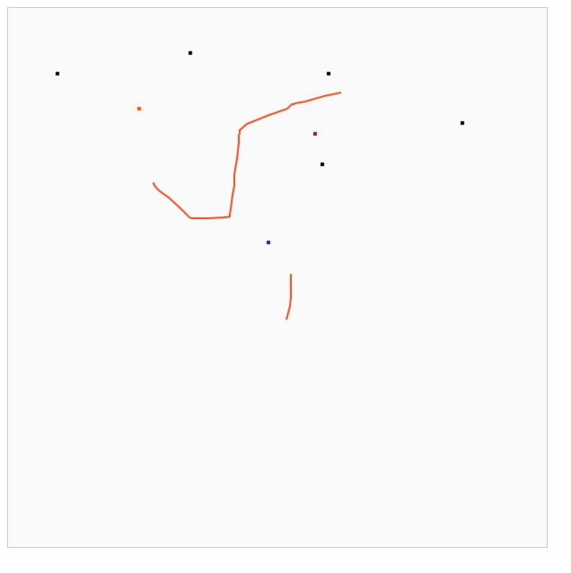

# DrawingApp

## Challenge - drawing app

In this challenge, we expect you to create a webapp that allows users to draw a dot by clicking anywhere on the screen.
Clicking in multiple points will obviously draw multiple dots.

These dots must be persisted by the server and whenever the user reloads the page, the dots must be loaded and presented.

### Extra challenge 1

When a user clicks a dot for a second time, the dot will be assigned a random colour.

### Extra challenge 2

The user may click, drag the mouse, and release, in order to draw a line.

### Extra challenge 3

Multiple users may use the webapp and see the dots drawn by the other in quasi-real time.

## Solution

The solution is implemented as a ReactJS (front-end) + Rails API backend.



### Usage

To start the rails server, change into the project folder and bootstrap the rails application:

```
$ git clone git@github.com:chalmagean/drawing_app.git
$ cd drawing_app
$ bundle install
$ rake db:create
$ rake db:migrate
$ rails s
```

Then open the web application by visiting `http://localhost:3000` in your browser.

